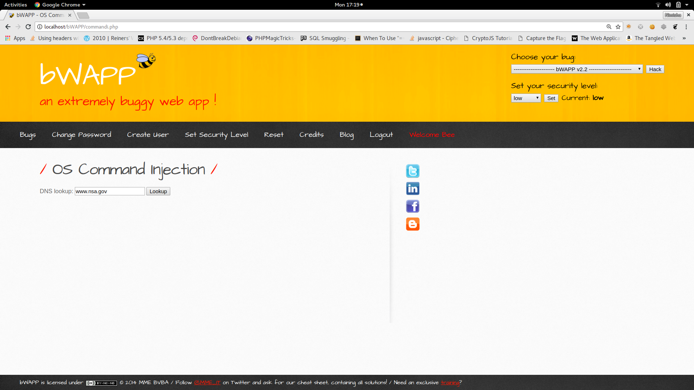
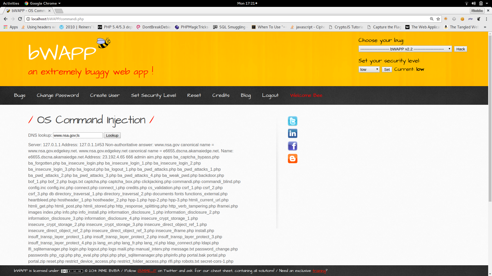

# OS Command Injection

___

OS injection is a vulnerability seen in the websites that execute the system commands via web interface. OS command injection spoils the whole control access model of the website and the attacker gains the complete access over the website. With this ability attacker steals passwords and any other important files of the web site.

### Possible Injection Points
* GET : urls
* POST : input via post method
* HTTP headers : cookies, x-forward-for, user-agent, referrer .....
        These are some possible places worth checking for injection.
        
### How to Exploit OS command Injection 
First step is to know the injection point and understand the functionality then use ping command to identify injection point, if there are any filters then use different kinds of operators. 

For example, consider a scenario as shown in the image below.

It takes some address as input and will ping the given web address i.e the input is executed as os command. Now that we can execute OS commands, we can give some command like " ls " to see what all files are there in the working directory, which may output something like this

There may be filters which does not allow the use of semi colon, then other operators like " & " can be used.

#### Some other useful operators
| Operator | Use |
|---------|------|
| ; | Multiple shell commands are be seperated with semicolon and are executed at a time.|
| & | It seperates two shell commands on one command line. It executes first command then second. |
| && | When this is used between two commands, second command is executed only if the first is true |
|\|\|  | Redirects the output of the first command to the input of the second command|

Similar to SQL injection analysis of OS command injection can be done in two ways - 1) result based and 2) blind command injections.

##### 1)Result - based injections:

When the attacker injects code then the output is displayed on the webpage. The output may be error as in sql injection or actual output of the command executed. The example from above can be considered as result based.

##### 2)Blind injections:

Here the output of the injected code will not be displayed,then other technique's are used. One of which is transferring the output to other accessible locations and then viewing that file.
